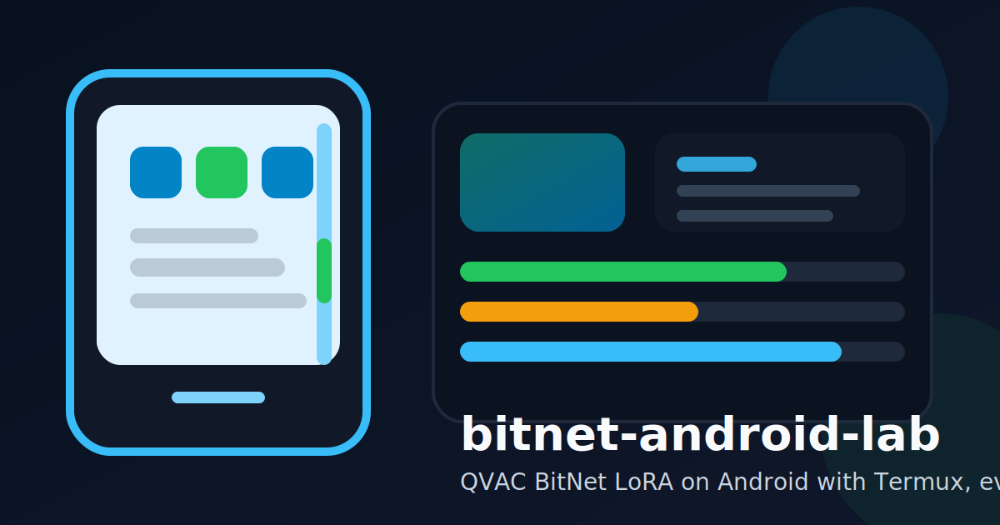

# bitnet-android-lab

[English README](./README.md)

実機 Android 端末で、Termux・`adb forward`・SSH・Vulkan を使って QVAC Fabric BitNet の LoRA 微調整を試した記録、パッチ、evidence、監視ヘルパーをまとめた公開 lab リポジトリです。

このリポジトリの主張は意図的に限定しています。2026 年 3 月 23 日に確認できた 1 台の実機パスと、2026 年 3 月 25 日の追跡確認だけを公開しており、QVAC や Hugging Face の公式配布物でも、広い Android 互換性を示すものでもありません。

## 検証済みスナップショット

| 項目 | 状態 | 補足 |
| --- | --- | --- |
| Windows -> `adb forward` -> SSH -> Termux 接続 | Verified | 公開物から秘密鍵パスと端末シリアルは除外 |
| Termux 上の patched local `qvac-fabric-llm.cpp` build | Verified | upstream commit `a218e05479cc019dfa592a7fae2d6d82065012cc` を使用 |
| TQ1 ベースモデル + 公開 biomedical adapter 推論 | Verified | 単発 rerun と throughput 参照値を記録 |
| TQ2 tiny LoRA checkpoint progression | Verified | checkpoint step 6 まで到達 |
| TQ2 checkpoint-based fast inference | Verified | 短い非空 completion を確認 |
| 公式 `llama-b7336-bin-android.zip` をそのまま Termux CLI bundle として使う経路 | Not verified | この lab では turnkey な CLI bundle ではなく Android app build artifact に見えた |

## クイックスタート

1. [`docs/guide/setup-termux.md`](./docs/guide/setup-termux.md) か公開 docs <https://sunwood-ai-labs.github.io/bitnet-android-lab/> を読みます。
2. [`patches/qvac-fabric-llm.cpp/`](./patches/qvac-fabric-llm.cpp/) の patch を upstream commit `a218e05479cc019dfa592a7fae2d6d82065012cc` に適用します。
3. モデル、adapter、dataset を端末側の `QVAC_ROOT` 配下に配置します。この repo 自体には weights や dataset は含みません。
4. [`scripts/termux/`](./scripts/termux/) の helper script を、自分の環境変数とパスに合わせて実行します。
5. [`evidence/manifest.md`](./evidence/manifest.md) と [`evidence/logs/`](./evidence/logs/) を見て、出力を照合します。

## 監視ヘルパー

観察用の補助として、2 つの監視経路を用意しています。

- Termux 側 TUI ツール: [`scripts/termux/install_monitoring_tools.sh`](./scripts/termux/install_monitoring_tools.sh) で `gotop`、`htop`、`bmon` を導入
- Windows 側 `adb` watcher: [`scripts/windows/watch_android_resources.ps1`](./scripts/windows/watch_android_resources.ps1) でメモリ / スワップのバー、各コア使用率バー、各コア周波数、`top`、`dumpsys cpuinfo`、`dumpsys meminfo` を 1 画面表示

どちらも観察用途であり、ベンチマーク計測用途ではありません。監視そのものがタイミングに影響することがあり、接続先デバイスの package 名や process 名が表示される場合もあります。

## リポジトリ構成

- [`docs/`](./docs/) は公開 docs 用の guide / results / reference を収録
- [`evidence/`](./evidence/) は公開 claim と日付付き log snippet の対応を管理
- [`patches/qvac-fabric-llm.cpp/`](./patches/qvac-fabric-llm.cpp/) は Termux workaround patch を格納
- [`scripts/termux/`](./scripts/termux/) は Termux 側 helper
- [`scripts/windows/`](./scripts/windows/) は Windows 側 helper
- [`THIRD_PARTY.md`](./THIRD_PARTY.md) は upstream provenance を記録

## 注意点

- 成功したのは stock の公式 Android bundle ではなく、local patched source build の経路です。
- TQ2 の成功例は `checkpoint_step_00000006/model.gguf` という中間 checkpoint artifact を使っており、最終 `--output-adapter` の検証ではありません。
- 公開している `tok/s` は単発 run の参照値であり、benchmark median や sustained-speed claim ではありません。
- 終了時には `FORTIFY: pthread_mutex_lock called on a destroyed mutex` が残っており、長時間運用や repeated-run 安定性は未検証です。
- tiny training smoke run では、2 行の入力 subset に対して runtime が `datapoints=5` を報告する未解決の不一致があります。

## Docs

- 公開サイト: <https://sunwood-ai-labs.github.io/bitnet-android-lab/>
- Guide: [`docs/guide/setup-termux.md`](./docs/guide/setup-termux.md)
- Results: [`docs/results/experiment-log.md`](./docs/results/experiment-log.md), [`docs/results/findings.md`](./docs/results/findings.md)
- Reference: [`docs/reference/limitations.md`](./docs/reference/limitations.md), [`docs/reference/evidence.md`](./docs/reference/evidence.md)

## 参照元

- Hugging Face article: [LoRA Fine-Tuning BitNet b1.58 LLMs on Heterogeneous Edge GPUs via QVAC Fabric](https://huggingface.co/blog/qvac/fabric-llm-finetune-bitnet)
- Upstream code: [tetherto/qvac-fabric-llm.cpp](https://github.com/tetherto/qvac-fabric-llm.cpp)
- Model collection: [qvac/fabric-llm-finetune-bitnet](https://huggingface.co/qvac/fabric-llm-finetune-bitnet)
